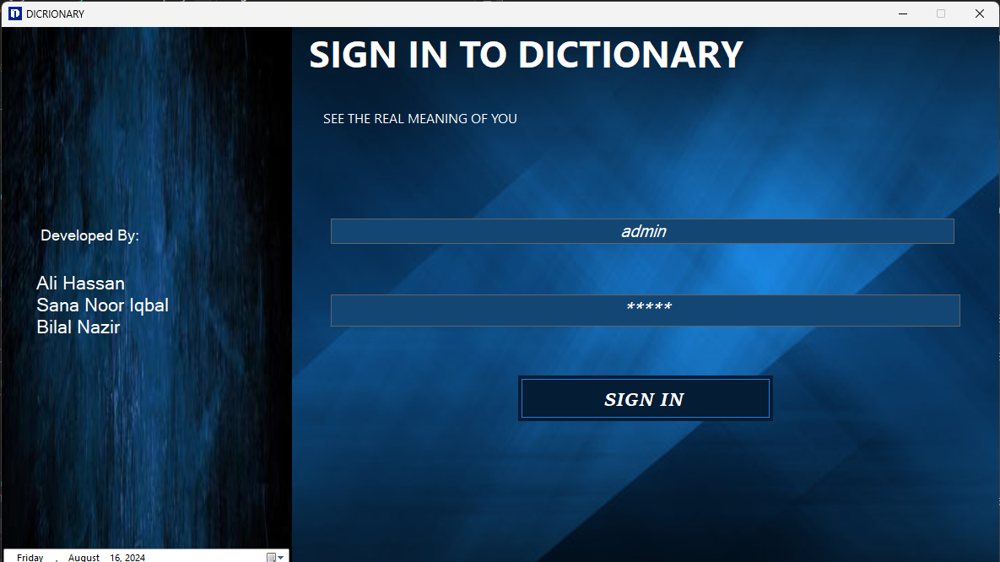
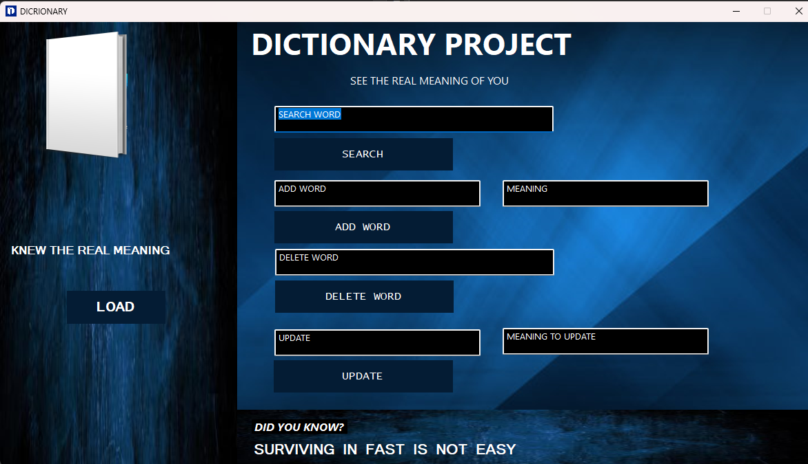

# C++ Dictionary Application

## LinkedIn : [Ali Hassan](https://www.linkedin.com/in/ali-hassan-08b306226/)

This project is a Dictionary application created as a semester project for the Data Structures course. The application is built using C++ and Windows Forms, providing a user-friendly interface to manage a dictionary of words and their meanings.

## Features

- **Login Form:** Secure login system to access the dictionary.
- **Home Page:** Main interface for dictionary management.
  - **Load Dictionary:** Load the dictionary from a file.
  - **Search:** Search for words and view their meanings.
  - **Add:** Add new words and their meanings.
  - **Update:** Update existing words with new meanings.
  - **Delete:** Remove words from the dictionary.

## Project Structure

- **Forms:**
  - `SIGNIN.h` and `SIGNIN.resx`: Handles the login form.
  - `MyForm.h` and `MyForm.resx`: Main interface for dictionary operations.
- **Source Files:**
  - `MAIN.cpp`: Contains the main function.
  - `Source.cpp`: Contains the logic for dictionary operations.
- **Header Files:**
  - `DICTIONARY.h`: Header file containing dictionary class declarations.
- **Resources:**
  - `icon`: Icon for the application.
  - `LEFTBACK.jpg` and `RIGHTBACK.jpg`: Images used in the application.
- **Other Files:**
  - `Project2.vcxproj`, `Project2.vcxproj.filters`, and `Project2.vcxproj.user`: Visual Studio project files.
  - `README.md`: This README file.
  
## Getting Started

### Prerequisites

- Visual Studio 2022 or later.
- Windows OS.

### Running the Application

1. Clone this repository to your local machine.
2. Open `project2.sln` in Visual Studio.
3. Build the project to ensure all dependencies are resolved.
4. Run the application from Visual Studio.

### Usage

- **Load the Dictionary:** Click the "Load" button to load words and their meanings from a file.
- **Manage Words:**
  - **Search:** Enter a word in the search bar to find its meaning.
  - **Add:** Enter a new word and its meaning, then click "Add" to include it in the dictionary.
  - **Update:** Select a word, change its meaning, and click "Update."
  - **Delete:** Select a word and click "Delete" to remove it from the dictionary.

## Screenshots

- 
- 

## Contributing

If you wish to contribute to the project, feel free to submit a pull request or report any issues you encounter.

- Github Repository Link : https://github.com/JIN-15/Dictionary.git

### Steps to Push Updates to GitHub

If you've already set up your repository but now need to push new files (like `README.md` and images) to GitHub, follow these steps:

1. **Open Git Bash or Command Prompt** in the root folder of your project.

2. **Stage the Changes:**
   ```bash
   git add .
   ```

3. **Commit the Changes:**
   ```bash
   git commit -m "Added README.md and images"
   ```

4. **Push the Changes to GitHub:**
   ```bash
   git push origin main
   ```

   Replace `main` with your branch name if it's different.

If you face any issues, feel free to ask!

# Contact

For any inquiries or issues, please contact [Ali Hassan](mailto:hassanakramali@gmail.com).